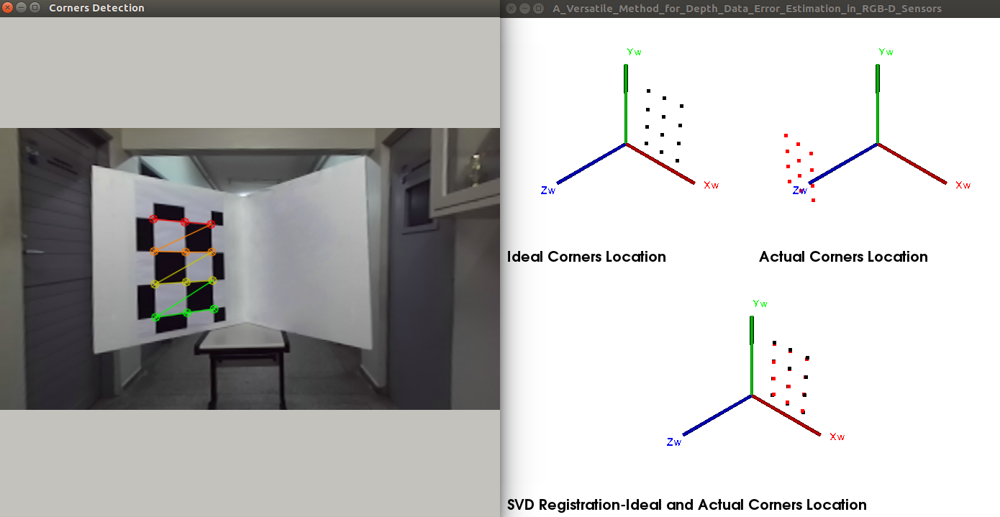

# <center> Depth Error Estimation of Static RGBD Sensors

---
This project allows computing the error in static RGB-D sensors. The code is the implementation of the papers: __[A Versatile Method for Depth Data Error Estimation in RGB-D Sensors](https://doi.org/10.3390/s18093122)__ and __[Depth Data Error Modeling of the ZED 3D Vision Sensor From Stereolabs](https://doi.org/10.5565/rev/elcvia.1084)__.



## Installation:
---

Dependences (mandatory):

+ **Eigen3**
+ **OpenCV**: tested with version 3.4.1.

Download code and open a terminal `ctrl+t`:

    $ cd path 
    $ mkdir build & cd build 
    $ cmake .. 
    $ make

## How to use:
---

+ **Run**: `./depth_error <save_windows> <device> <devide_resolution>`

+ **Inputs**:
    * `<save_windows>`: set `1` to save the pictures of the PCL 3D visualizer with the point clouds used to the depth error. Or choose `0` to save nothing.
    * `<device>`: choose the sensor to be evaluated, can be `1` for the __[Stereolabs ZED ](https://www.stereolabs.com/)__ camera or `2` for Kinect
    * `<devide_resolution>`: choose the resolution of the device that you use, for example: `4` for ZED `(672x376 px)`, `5` for Kinect version 1 `(640x480  px)` and `6` for Kinect version 2 `(512x424 px)`. Remember that the Kinect version 2 has two resolutions, `(1920x1080)` and `(512x424 px)`. We use the minor resolution because it is more similar to the other devices' resolutions, i.e., to make the comparison of the devices fairer.

+ **Outputs**:
    * `built/Results/`: a folder that contains the pictures of the PCL 3D visualizer with the point clouds used to the depth error. 
    * `Table_<devide_resolution>.txt`: *.txt* file with two columns, the first one represents the depth in millimeters, and the second one represents the RMSE error for this depth.

+ Example:
    ```
    $ ./depth_error 1 1 4 
    ```

## References:
---

Please cite the following papers if use this code and **A Versatile Method for Depth Data Error Estimation in RGB-D Sensors**:
```

@Article{Ortiz20182,
    AUTHOR = {Ortiz, Luis E. and Cabrera, Elizabeth V. and Silva, Bruno M. F. da and Clua, Esteban W. G. and Gonçalves, Luiz M. G.},
    TITLE = {A Versatile Method for Depth Data Error Estimation in RGB-D Sensors},
    JOURNAL = {Sensors},
    VOLUME = {18},
    YEAR = {2018},
    NUMBER = {9},
    ARTICLE-NUMBER = {3122},
    URL = {https://www.mdpi.com/1424-8220/18/9/3122},
    ISSN = {1424-8220},
    DOI = {10.3390/s18093122}
}

```   
```
@ARTICLE{Ortiz2018,
    TITLE   = {Depth data error modeling of the ZED 3D vision sensor from stereolabs},
    AUTHOR  = {Ortiz, Luis Enrique and Cabrera, Elizabeth V and Gon{\c{c}}alves, Luiz M},
    JOURNAL = {ELCVIA: electronic letters on computer vision and image analysis},
    VOLUME  = {17},
    NUMBER  = {1},
    PAGES   = {0001--15},
    YEAR    = {2018},
    DOI     = {https://doi.org/10.5565/rev/elcvia.1084},
    eISSN   = {1577-5097} 
}
```

## NOTE:

| If you find any of these codes helpful, please share my __[GitHub](https://github.com/LuisOrtizF)__ and __*STAR*__ :star: this repository to help other enthusiasts to find these tools. Remember, the knowledge must be shared. Otherwise, it is useless and lost in time.|
| :----------- |
